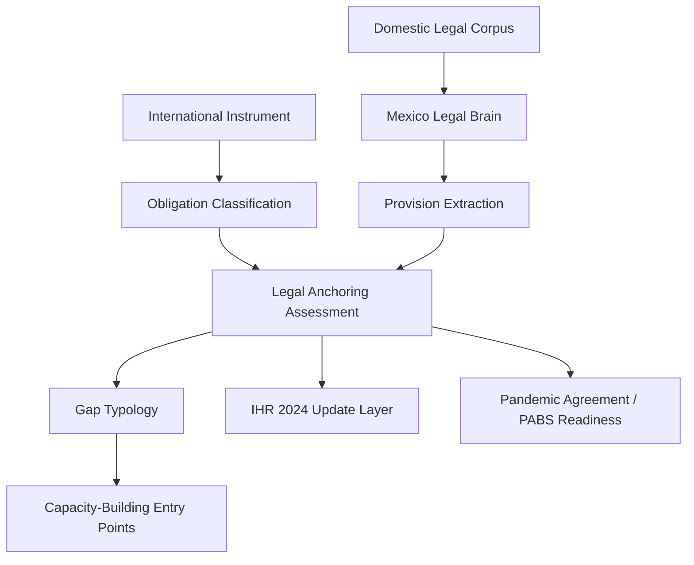

# Methodology

## Executive summary
> **What this methodology solves:**
> - Existing IHR monitoring tools are useful but do not fully reconstruct domestic legal anchoring.
> - SPAR is standardized and recurrent but self-reported.
> - JEE, AAR and SimEx add external and functional assessment layers but do not map each international obligation to domestic legal authority, actors, procedures and safeguards.
> - NormTrace-IHR adds a country-specific legal-institutional conversion layer.
> - The output is not a compliance score; it is a traceability and review infrastructure.

## Methodological problem
International obligations are monitored, but domestic legal conversion is often opaque. Many states report capacity in SPAR or JEE without having clear, statutory anchoring for that capacity in their domestic legal architecture.

Self-reported capacity can diverge from legally anchored capacity. An agency may perform a function by practice or custom (de facto) without a clear legal mandate (de jure), which creates institutional vulnerability and lack of accountability.

Capacity-building needs more specific information about domestic legal instruments, actors, competences, procedures, coordination and safeguards. To strengthen a health system, one must know exactly which article of which law needs to be amended, which actor has the power to act, and what procedural gaps exist.

## Conceptual model
International obligation
→ legal anchoring need
→ domestic legal corpus
→ country legal brain
→ provision extraction
→ actor and competence mapping
→ anchoring assessment
→ gap typology
→ capacity-building entry point

1. **International obligation**: Identify the specific duty in IHR 2005, 2024, or Pandemic Agreement.
2. **Legal anchoring need**: Determine what kind of domestic law is needed to fulfill the obligation.
3. **Domestic legal corpus**: Collect the relevant national laws, regulations, and norms.
4. **Country legal brain**: Apply the country-specific legal logic (e.g., Mexico's federalism).
5. **Provision extraction**: Isolate the specific articles and fractions relevant to the obligation.
6. **Actor and competence mapping**: Identify which entity has the legal power to execute the provision.
7. **Anchoring assessment**: Score the strength of the legal link using the 0-5 scale.
8. **Gap typology**: Classify why anchoring is weak or missing.
9. **Capacity-building entry point**: Identify the specific legal or institutional lever for improvement.

## Analytical layers
| Layer | Question | Input | Output |
| :--- | :--- | :--- | :--- |
| IHR obligation classification | What exactly does the treaty require? | IHR 2005/2024 text | Obligation ID and type |
| Domestic legal corpus | Which laws are in scope? | Source PDF/HTML | Markdown corpus |
| Mexico legal system profile | How does the legal system work? | Constitutional law | Mexico legal brain |
| Legislative drafting patterns | How are powers usually granted? | Administrative law | Pattern rules |
| Domestic provision extraction | Where is the relevant text? | Markdown corpus | Provision table |
| Actor and competence mapping | Who has the authority? | Institutional law | Actor mapping |
| Legal anchoring assessment | How strong is the link? | Mapping rules | Anchoring level |
| IHR 2024 update layer | What changed in 2024? | IHR 2024 amendments | Update-review layer |
| Pandemic Agreement readiness | Is the system ready for PA/PABS? | Draft PA text | Readiness layer |
| Technical validation | Is the data accurate? | Validation scripts | Audit report |

## Why this is not keyword matching
> **Note**: NormTrace-IHR does not simply match words between the IHR and Mexican laws. It first reconstructs Mexico’s constitutional, federal, administrative, health-governance and regulatory architecture. Matching is then performed within that country-specific legal logic. A keyword search for "surveillance" might miss the specific administrative "atribuciones" that actually anchor the function.

## Country-specific legal brain
| Component | Why it matters for IHR mapping |
| :--- | :--- |
| constitutional architecture | Defines the ultimate source of power for health measures. |
| treaty effect | Determines how IHR obligations enter the domestic hierarchy. |
| legal hierarchy | Distinguishes between laws (LGS) and regulations (RISI/NOM). |
| federalism | Allocates competences between Federation and States. |
| health governance | Defines the roles of SS, CSG, and other health actors. |
| public administration | Sets the rules for internal regulations and delegations. |
| regulatory instruments | Identifies the role of NOMs in technical standards. |
| legislative drafting patterns | Recognizes how "deberá" vs "podrá" creates obligations. |
| oversight and accountability | Maps the role of CNDH and administrative courts. |
| legal anchoring rules | Defines what counts as Level 3 vs Level 5 anchoring. |

## Source corpus workflow
1. Convert legal sources to Markdown
2. Create metadata
3. Classify instrument type
4. Classify normative hierarchy
5. Classify sector/legal domain
6. Detect structure
7. Extract provisions
8. Link provisions to actors and obligations
9. Validate IDs and references
10. Generate outputs

| Corpus field | Purpose |
| :--- | :--- |
| instrument_type | Distinguishes Law, Regulation, Decree, Agreement, NOM. |
| normative_hierarchy | Ranks the instrument in the legal pyramid. |
| sector/legal_domain | Identifies Public Administration, Health, Trade, etc. |
| issuing_authority | The actor who published the instrument. |
| government_level | Federal, State, or Local. |
| legal_function | Governance, Surveillance, Response, Finance. |
| publication_date | Tracks the currency of the instrument. |
| last_amendment_date | Tracks recent updates. |
| source_status | Active, Repealed, or Reform in progress. |
| relevance_for_ihr | Binary or categorical relevance to IHR. |
| relevance_for_pandemic_agreement | Binary or categorical relevance to PA. |

## Legislative pattern extraction
| Pattern detected | Analytical use |
| :--- | :--- |
| Articles, fractions, paragraphs | Unit of analysis for extraction. |
| Transitory provisions | Identifies effective dates and implementation duties. |
| “corresponde a” | Assigns core competence to an actor. |
| “son atribuciones de” | Defines specific legal powers. |
| “deberá” | Creates a mandatory duty. |
| “podrá” | Creates a discretionary power. |
| “se coordinará” | Signals a multi-actor coordination mechanism. |
| “en el ámbito de sus competencias” | Signals federal/state division of labour. |
| “sin perjuicio de” | Clarifies overlapping or non-exclusive powers. |
| “conforme a las disposiciones aplicables” | Points to lower-level regulatory needs. |
| NOM numerals | Identifies technical standards and protocols. |
| regulations and internal regulations | Maps administrative operationalisation. |
| administrative agreements | Maps specific inter-agency delegations. |

## Obligation classification rules
| Trigger | Likely anchoring implication |
| :--- | :--- |
| designated national authority | Requires high-level statutory/administrative designation. |
| duties for public authorities | Requires clear "atribuciones" in internal regulations. |
| obligations for private actors | Requires statutory basis (principle of legality). |
| restrictions on persons/travellers/goods | Requires statutory basis and constitutional safeguards. |
| coercive or sanitary measures | Requires clear legal mandate and proportionality rules. |
| sensitive data processing | Requires data protection and privacy anchoring. |
| mandatory information exchange | Requires procedural protocols and data-sharing agreements. |
| federal-state coordination | Requires coordination agreements or federal laws. |
| recurrent institutional capacity | Requires permanent administrative structure. |
| budgetary or planning implications | Requires inclusion in budget or development plans. |
| reviewable procedures | Requires administrative appeal or oversight mechanisms. |
| rights safeguards | Requires due process and human rights anchoring. |
| laboratories/pathogens/biosafety/benefit-sharing | Requires technical regulations and biosafety norms. |

## Anchoring scale
| Level | Label | Meaning | What it does not mean |
| :--- | :--- | :--- | :--- |
| 0 | No anchoring | No mention found in corpus. | Does not mean the capacity doesn't exist de facto. |
| 1 | Actor-only | Actor is mentioned but not the specific function. | Does not mean the actor is not doing it. |
| 2 | Indirect/Implicit | Function is implied by broader mandate. | Does not mean the mandate is clear. |
| 3 | Administrative/Internal | Function is in internal regulation or manual. | Does not mean it has a statutory (Law) basis. |
| 4 | General Statutory | Function is in a Law (e.g. LGS) but lacks detail. | Does not mean procedures are defined. |
| 5 | Specific Statutory | Function and procedure are in a Law. | Does not mean 100% compliance. |

> **Emphasis**: The scale measures identifiable legal-institutional anchoring in the available corpus. It does not measure compliance or actual operational performance.

## Gap typology
| Gap type | What it means | Why it matters |
| :--- | :--- | :--- |
| legal silence | No legal basis found for the obligation. | Absolute lack of de jure authority. |
| competence ambiguity | Unclear which actor has the power. | Risk of inaction or overlapping duties. |
| administrative-only anchoring | Basis is in regulation but not in Law. | Institutional vulnerability to admin changes. |
| procedural gap | Power exists but the "how" is missing. | Operational uncertainty and lack of due process. |
| coordination gap | No rule for how actors work together. | Siloed response and communication failures. |
| federal implementation gap | Federal power exists but state-level doesn't. | Incomplete national coverage. |
| rights-safeguard gap | Measure exists but oversight doesn't. | Risk of human rights violations. |
| oversight gap | No mechanism to review the performance. | Lack of accountability and learning. |
| budget/capacity gap | Mandate exists but no resource rule. | Unfunded mandates that fail to deliver. |
| update-review needed | Basis exists but needs 2024 alignment. | Non-alignment with latest international rules. |

## Role of SPAR, JEE, AAR and SimEx
| Tool | What it captures | Main limitation for legal anchoring | How NormTrace complements it |
| :--- | :--- | :--- | :--- |
| SPAR | Standardized self-assessment. | Self-reported; doesn't verify legal basis. | Provides the "de jure" verification. |
| JEE | External technical review. | Voluntary; high-level; not item-by-item. | Maps specific articles to each IHR item. |
| AAR | Operational experience. | Focused on a single event/function. | Connects event experience to systemic law. |
| SimEx | Tested performance. | Snapshot of capability in a simulation. | Identifies the legal levers to fix tested gaps. |
| **NormTrace-IHR** | **Legal-institutional architecture.** | **Limited to the available legal corpus.** | **Adds a legal conversion layer to all tools.** |

## Use of Python, AI and human review
| Function | Tool | Output | Human review needed? |
| :--- | :--- | :--- | :--- |
| data cleaning | Python | clean CSVs | No (automated validation) |
| schema validation | Python | validation logs | No (automated validation) |
| referential integrity | Python | audit reports | No (automated validation) |
| source structuring | AI-assisted | Markdown and metadata drafts | Yes (consistency check) |
| pattern detection | AI-assisted | legal drafting patterns | Yes (expert validation) |
| provision extraction | AI-assisted | preliminary provision tables | Yes (expert validation) |
| obligation mapping | AI-assisted + rule-based review | preliminary mappings | Yes (expert validation) |
| legal validation | human expert | validated interpretation | **Crucial (Final Authority)** |

> **Emphasis**: AI is used for assisted structuring and preliminary classification, not as final legal authority.

## Workflow diagram

## Limits
- **corpus-limited**: Only analyzes the provided digital legal corpus.
- **preliminary**: Results are subject to ongoing refinement.
- **AI-assisted**: Initial classifications are machine-suggested.
- **not legal advice**: Findings do not constitute professional legal counsel.
- **not compliance assessment**: Does not measure whether actors actually comply.
- **requires expert validation**: All mappings must be reviewed by legal experts.
- **PABS provisional**: Dependent on the finalization of the Pandemic Agreement Annex.
- **does not measure actual operational performance**: Focuses on the "de jure" architecture.

## References
- World Health Organization. (2005). International Health Regulations (2005).
- World Health Organization. (2024). Amendments to the International Health Regulations (2005).
- World Health Organization. (2024). Draft Pandemic Agreement.
- Mexican Federal Law. (2025). Ley General de Salud.
- Mexican Administrative Law. (2025). Reglamento Interior de la Secretaría de Salud.
